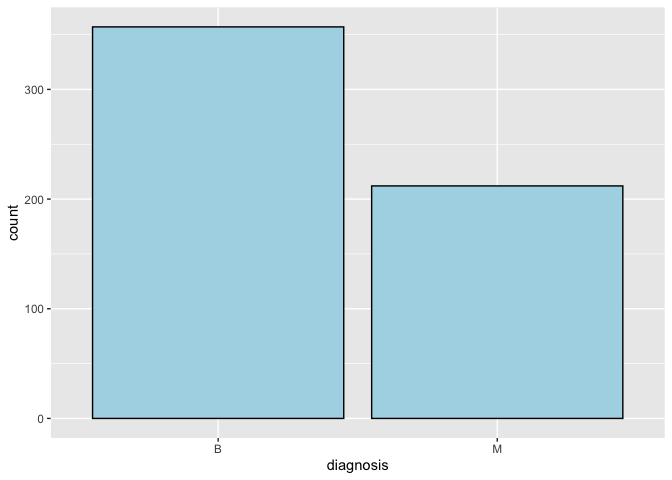
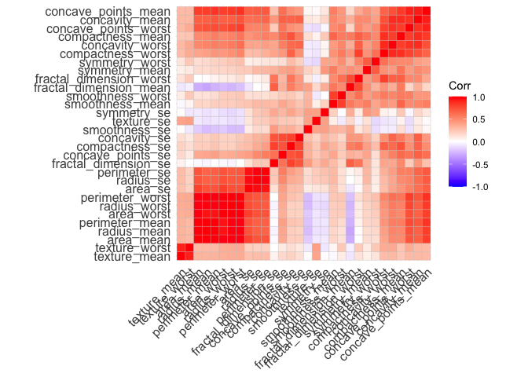
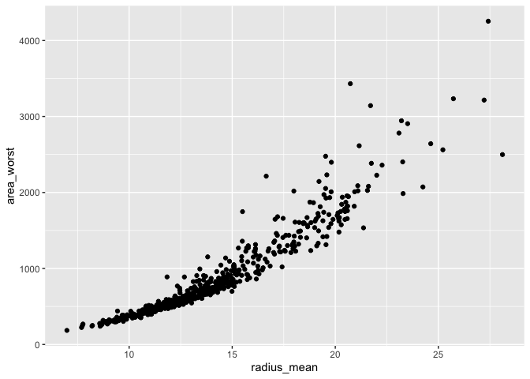
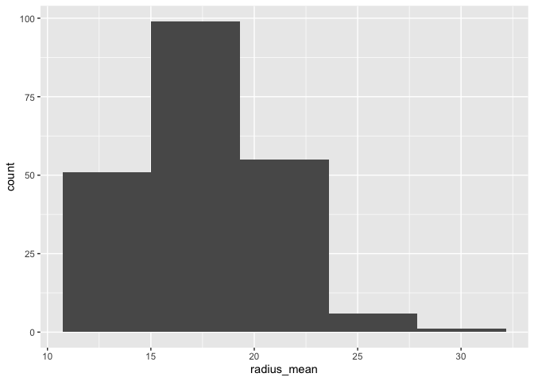
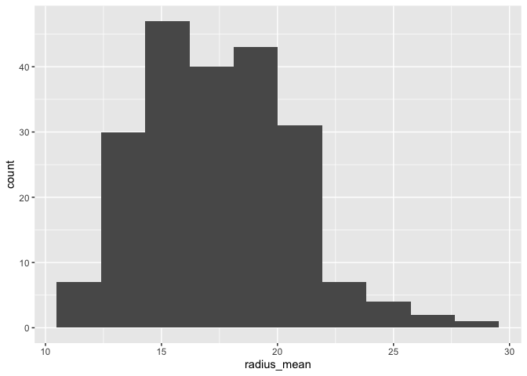
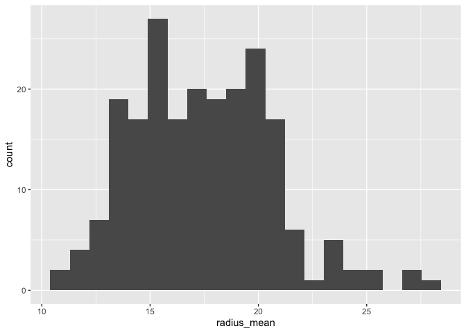
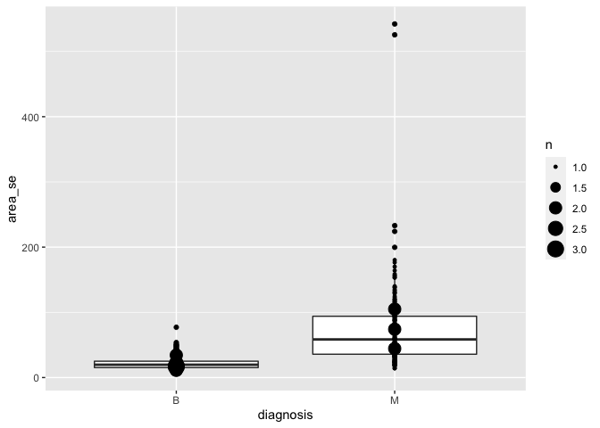
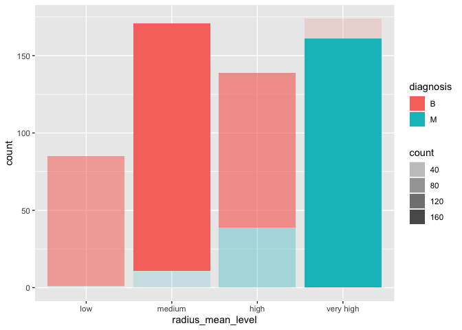

Mini Data-Analysis Deliverable 1
================

# Welcome to your (maybe) first-ever data analysis project!

And hopefully the first of many. Let’s get started:

1.  Install the [`datateachr`](https://github.com/UBC-MDS/datateachr)
    package by typing the following into your **R terminal**:

<!-- -->

    install.packages("devtools")
    devtools::install_github("UBC-MDS/datateachr")

1.  Load the packages below.

<!-- -->

    library(datateachr)
    library(tidyverse)

    ## ── Attaching packages ────────────────────────────────── tidyverse 1.3.2 ──✔ ggplot2 3.3.6      ✔ purrr   0.3.4 
    ## ✔ tibble  3.1.8      ✔ dplyr   1.0.10
    ## ✔ tidyr   1.2.1      ✔ stringr 1.4.1 
    ## ✔ readr   2.1.2      ✔ forcats 0.5.2

    ## Warning: package 'readr' was built under R version 3.6.2

    ## Warning: package 'purrr' was built under R version 3.6.2

    ## ── Conflicts ───────────────────────────────────── tidyverse_conflicts() ──
    ## ✖ dplyr::filter() masks stats::filter()
    ## ✖ dplyr::lag()    masks stats::lag()

    library(ggplot2)
    library(ggcorrplot)
    library(corrplot)

    ## corrplot 0.92 loaded

1.  Make a repository in the
    <a href="https://github.com/stat545ubc-2022" class="uri">https://github.com/stat545ubc-2022</a>
    Organization. You will be working with this repository for the
    entire data analysis project. You can either make it public, or make
    it private and add the TA’s and Lucy as collaborators.

# Instructions

## For Both Milestones

-   Each milestone is worth 45 points. The number of points allocated to
    each task will be annotated within each deliverable. Tasks that are
    more challenging will often be allocated more points.

-   10 points will be allocated to the reproducibility, cleanliness, and
    coherence of the overall analysis. While the two milestones will be
    submitted as independent deliverables, the analysis itself is a
    continuum - think of it as two chapters to a story. Each chapter, or
    in this case, portion of your analysis, should be easily followed
    through by someone unfamiliar with the content.
    [Here](https://swcarpentry.github.io/r-novice-inflammation/06-best-practices-R/)
    is a good resource for what constitutes “good code”. Learning good
    coding practices early in your career will save you hassle later on!

## For Milestone 1

**To complete this milestone**, edit [this very `.Rmd`
file](https://raw.githubusercontent.com/UBC-STAT/stat545.stat.ubc.ca/master/content/mini-project/mini-project-1.Rmd)
directly. Fill in the sections that are tagged with
`<!--- start your work below --->`.

**To submit this milestone**, make sure to knit this `.Rmd` file to an
`.md` file by changing the YAML output settings from
`output: html_document` to `output: github_document`. Commit and push
all of your work to the mini-analysis GitHub repository you made
earlier, and tag a release on GitHub. Then, submit a link to your tagged
release on canvas.

**Points**: This milestone is worth 45 points: 43 for your analysis, 1
point for having your Milestone 1 document knit error-free, and 1 point
for tagging your release on Github.

# Learning Objectives

By the end of this milestone, you should:

-   Become familiar with your dataset of choosing
-   Select 4 questions that you would like to answer with your data
-   Generate a reproducible and clear report using R Markdown
-   Become familiar with manipulating and summarizing your data in
    tibbles using `dplyr`, with a research question in mind.

# Task 1: Choose your favorite dataset (10 points)

The `datateachr` package by Hayley Boyce and Jordan Bourak currently
composed of 7 semi-tidy datasets for educational purposes. Here is a
brief description of each dataset:

-   *apt\_buildings*: Acquired courtesy of The City of Toronto’s Open
    Data Portal. It currently has 3455 rows and 37 columns.

-   *building\_permits*: Acquired courtesy of The City of Vancouver’s
    Open Data Portal. It currently has 20680 rows and 14 columns.

-   *cancer\_sample*: Acquired courtesy of UCI Machine Learning
    Repository. It currently has 569 rows and 32 columns.

-   *flow\_sample*: Acquired courtesy of The Government of Canada’s
    Historical Hydrometric Database. It currently has 218 rows and 7
    columns.

-   *parking\_meters*: Acquired courtesy of The City of Vancouver’s Open
    Data Portal. It currently has 10032 rows and 22 columns.

-   *steam\_games*: Acquired courtesy of Kaggle. It currently has 40833
    rows and 21 columns.

-   *vancouver\_trees*: Acquired courtesy of The City of Vancouver’s
    Open Data Portal. It currently has 146611 rows and 20 columns.

**Things to keep in mind**

-   We hope that this project will serve as practice for carrying our
    your own *independent* data analysis. Remember to comment your code,
    be explicit about what you are doing, and write notes in this
    markdown document when you feel that context is required. As you
    advance in the project, prompts and hints to do this will be
    diminished - it’ll be up to you!

-   Before choosing a dataset, you should always keep in mind **your
    goal**, or in other ways, *what you wish to achieve with this data*.
    This mini data-analysis project focuses on *data wrangling*,
    *tidying*, and *visualization*. In short, it’s a way for you to get
    your feet wet with exploring data on your own.

And that is exactly the first thing that you will do!

1.1 Out of the 7 datasets available in the `datateachr` package, choose
**4** that appeal to you based on their description. Write your choices
below:

**Note**: We encourage you to use the ones in the `datateachr` package,
but if you have a dataset that you’d really like to use, you can include
it here. But, please check with a member of the teaching team to see
whether the dataset is of appropriate complexity. Also, include a
**brief** description of the dataset here to help the teaching team
understand your data.

<!-------------------------- Start your work below ---------------------------->

Choice 1: cancer\_sample  
Choice 2: apt\_buildings  
Choice 3: parking\_meters  
Choice 4: flow\_sample  

<!----------------------------------------------------------------------------->

1.2 One way to narrowing down your selection is to *explore* the
datasets. Use your knowledge of dplyr to find out at least *3*
attributes about each of these datasets (an attribute is something such
as number of rows, variables, class type…). The goal here is to have an
idea of *what the data looks like*.

*Hint:* This is one of those times when you should think about the
cleanliness of your analysis. I added a single code chunk for you below,
but do you want to use more than one? Would you like to write more
comments outside of the code chunk?

<!-------------------------- Start your work below ---------------------------->

    # cancer_sample dataset
    glimpse(datateachr::cancer_sample)

    ## Rows: 569
    ## Columns: 32
    ## $ ID                      <dbl> 842302, 842517, 84300903, 84348301, 84358…
    ## $ diagnosis               <chr> "M", "M", "M", "M", "M", "M", "M", "M", "…
    ## $ radius_mean             <dbl> 17.990, 20.570, 19.690, 11.420, 20.290, 1…
    ## $ texture_mean            <dbl> 10.38, 17.77, 21.25, 20.38, 14.34, 15.70,…
    ## $ perimeter_mean          <dbl> 122.80, 132.90, 130.00, 77.58, 135.10, 82…
    ## $ area_mean               <dbl> 1001.0, 1326.0, 1203.0, 386.1, 1297.0, 47…
    ## $ smoothness_mean         <dbl> 0.11840, 0.08474, 0.10960, 0.14250, 0.100…
    ## $ compactness_mean        <dbl> 0.27760, 0.07864, 0.15990, 0.28390, 0.132…
    ## $ concavity_mean          <dbl> 0.30010, 0.08690, 0.19740, 0.24140, 0.198…
    ## $ concave_points_mean     <dbl> 0.14710, 0.07017, 0.12790, 0.10520, 0.104…
    ## $ symmetry_mean           <dbl> 0.2419, 0.1812, 0.2069, 0.2597, 0.1809, 0…
    ## $ fractal_dimension_mean  <dbl> 0.07871, 0.05667, 0.05999, 0.09744, 0.058…
    ## $ radius_se               <dbl> 1.0950, 0.5435, 0.7456, 0.4956, 0.7572, 0…
    ## $ texture_se              <dbl> 0.9053, 0.7339, 0.7869, 1.1560, 0.7813, 0…
    ## $ perimeter_se            <dbl> 8.589, 3.398, 4.585, 3.445, 5.438, 2.217,…
    ## $ area_se                 <dbl> 153.40, 74.08, 94.03, 27.23, 94.44, 27.19…
    ## $ smoothness_se           <dbl> 0.006399, 0.005225, 0.006150, 0.009110, 0…
    ## $ compactness_se          <dbl> 0.049040, 0.013080, 0.040060, 0.074580, 0…
    ## $ concavity_se            <dbl> 0.05373, 0.01860, 0.03832, 0.05661, 0.056…
    ## $ concave_points_se       <dbl> 0.015870, 0.013400, 0.020580, 0.018670, 0…
    ## $ symmetry_se             <dbl> 0.03003, 0.01389, 0.02250, 0.05963, 0.017…
    ## $ fractal_dimension_se    <dbl> 0.006193, 0.003532, 0.004571, 0.009208, 0…
    ## $ radius_worst            <dbl> 25.38, 24.99, 23.57, 14.91, 22.54, 15.47,…
    ## $ texture_worst           <dbl> 17.33, 23.41, 25.53, 26.50, 16.67, 23.75,…
    ## $ perimeter_worst         <dbl> 184.60, 158.80, 152.50, 98.87, 152.20, 10…
    ## $ area_worst              <dbl> 2019.0, 1956.0, 1709.0, 567.7, 1575.0, 74…
    ## $ smoothness_worst        <dbl> 0.1622, 0.1238, 0.1444, 0.2098, 0.1374, 0…
    ## $ compactness_worst       <dbl> 0.6656, 0.1866, 0.4245, 0.8663, 0.2050, 0…
    ## $ concavity_worst         <dbl> 0.71190, 0.24160, 0.45040, 0.68690, 0.400…
    ## $ concave_points_worst    <dbl> 0.26540, 0.18600, 0.24300, 0.25750, 0.162…
    ## $ symmetry_worst          <dbl> 0.4601, 0.2750, 0.3613, 0.6638, 0.2364, 0…
    ## $ fractal_dimension_worst <dbl> 0.11890, 0.08902, 0.08758, 0.17300, 0.076…

The cancer\_sample dataset contains 569 rows, 32 variables, and contains
dbl and chr as datatypes.

    # apt_buildings dataset 
    glimpse(datateachr::apt_buildings)

    ## Rows: 3,455
    ## Columns: 37
    ## $ id                               <dbl> 10359, 10360, 10361, 10362, 1036…
    ## $ air_conditioning                 <chr> "NONE", "NONE", "NONE", "NONE", …
    ## $ amenities                        <chr> "Outdoor rec facilities", "Outdo…
    ## $ balconies                        <chr> "YES", "YES", "YES", "YES", "NO"…
    ## $ barrier_free_accessibilty_entr   <chr> "YES", "NO", "NO", "YES", "NO", …
    ## $ bike_parking                     <chr> "0 indoor parking spots and 10 o…
    ## $ exterior_fire_escape             <chr> "NO", "NO", "NO", "YES", "NO", N…
    ## $ fire_alarm                       <chr> "YES", "YES", "YES", "YES", "YES…
    ## $ garbage_chutes                   <chr> "YES", "YES", "NO", "NO", "NO", …
    ## $ heating_type                     <chr> "HOT WATER", "HOT WATER", "HOT W…
    ## $ intercom                         <chr> "YES", "YES", "YES", "YES", "YES…
    ## $ laundry_room                     <chr> "YES", "YES", "YES", "YES", "YES…
    ## $ locker_or_storage_room           <chr> "NO", "YES", "YES", "YES", "NO",…
    ## $ no_of_elevators                  <dbl> 3, 3, 0, 1, 0, 0, 0, 2, 4, 2, 0,…
    ## $ parking_type                     <chr> "Underground Garage , Garage acc…
    ## $ pets_allowed                     <chr> "YES", "YES", "YES", "YES", "YES…
    ## $ prop_management_company_name     <chr> NA, "SCHICKEDANZ BROS. PROPERTIE…
    ## $ property_type                    <chr> "PRIVATE", "PRIVATE", "PRIVATE",…
    ## $ rsn                              <dbl> 4154812, 4154815, 4155295, 41553…
    ## $ separate_gas_meters              <chr> "NO", "NO", "NO", "NO", "NO", "N…
    ## $ separate_hydro_meters            <chr> "YES", "YES", "YES", "YES", "YES…
    ## $ separate_water_meters            <chr> "NO", "NO", "NO", "NO", "NO", "N…
    ## $ site_address                     <chr> "65  FOREST MANOR RD", "70  CLIP…
    ## $ sprinkler_system                 <chr> "YES", "YES", "NO", "YES", "NO",…
    ## $ visitor_parking                  <chr> "PAID", "FREE", "UNAVAILABLE", "…
    ## $ ward                             <chr> "17", "17", "03", "03", "02", "0…
    ## $ window_type                      <chr> "DOUBLE PANE", "DOUBLE PANE", "D…
    ## $ year_built                       <dbl> 1967, 1970, 1927, 1959, 1943, 19…
    ## $ year_registered                  <dbl> 2017, 2017, 2017, 2017, 2017, NA…
    ## $ no_of_storeys                    <dbl> 17, 14, 4, 5, 4, 4, 4, 7, 32, 4,…
    ## $ emergency_power                  <chr> "NO", "YES", "NO", "NO", "NO", "…
    ## $ `non-smoking_building`           <chr> "YES", "NO", "YES", "YES", "YES"…
    ## $ no_of_units                      <dbl> 218, 206, 34, 42, 25, 34, 14, 10…
    ## $ no_of_accessible_parking_spaces  <dbl> 8, 10, 20, 42, 12, 0, 5, 1, 1, 6…
    ## $ facilities_available             <chr> "Recycling bins", "Green Bin / O…
    ## $ cooling_room                     <chr> "NO", "NO", "NO", "NO", "NO", "N…
    ## $ no_barrier_free_accessible_units <dbl> 2, 0, 0, 42, 0, NA, 14, 0, 0, 1,…

The apt\_building dataset contains 3,455 rows and 37 varaibles. It also
contains both dbl and chr datatypes.

    # parking_meters dataset 
    glimpse(datateachr::parking_meters)

    ## Rows: 10,032
    ## Columns: 22
    ## $ meter_head     <chr> "Twin", "Pay Station", "Twin", "Single", "Twin", "…
    ## $ r_mf_9a_6p     <chr> "$2.00", "$1.00", "$1.00", "$1.00", "$2.00", "$2.0…
    ## $ r_mf_6p_10     <chr> "$4.00", "$1.00", "$1.00", "$1.00", "$1.00", "$1.0…
    ## $ r_sa_9a_6p     <chr> "$2.00", "$1.00", "$1.00", "$1.00", "$2.00", "$2.0…
    ## $ r_sa_6p_10     <chr> "$4.00", "$1.00", "$1.00", "$1.00", "$1.00", "$1.0…
    ## $ r_su_9a_6p     <chr> "$2.00", "$1.00", "$1.00", "$1.00", "$2.00", "$2.0…
    ## $ r_su_6p_10     <chr> "$4.00", "$1.00", "$1.00", "$1.00", "$1.00", "$1.0…
    ## $ rate_misc      <chr> NA, "$ .50", NA, NA, NA, NA, NA, NA, NA, NA, NA, N…
    ## $ time_in_effect <chr> "METER IN EFFECT: 9:00 AM TO 10:00 PM", "METER IN …
    ## $ t_mf_9a_6p     <chr> "2 Hr", "10 Hrs", "2 Hr", "2 Hr", "2 Hr", "3 Hr", …
    ## $ t_mf_6p_10     <chr> "4 Hr", "10 Hrs", "4 Hr", "4 Hr", "4 Hr", "4 Hr", …
    ## $ t_sa_9a_6p     <chr> "2 Hr", "10 Hrs", "2 Hr", "2 Hr", "2 Hr", "3 Hr", …
    ## $ t_sa_6p_10     <chr> "4 Hr", "10 Hrs", "4 Hr", "4 Hr", "4 Hr", "4 Hr", …
    ## $ t_su_9a_6p     <chr> "2 Hr", "10 Hrs", "2 Hr", "2 Hr", "2 Hr", "3 Hr", …
    ## $ t_su_6p_10     <chr> "4 Hr", "10 Hrs", "4 Hr", "4 Hr", "4 Hr", "4 Hr", …
    ## $ time_misc      <chr> NA, "No Time Limit", NA, NA, NA, NA, NA, NA, NA, N…
    ## $ credit_card    <chr> "No", "Yes", "No", "No", "No", "No", "No", "No", "…
    ## $ pay_phone      <chr> "66890", "59916", "57042", "57159", "51104", "6086…
    ## $ longitude      <dbl> -123.1289, -123.0982, -123.1013, -123.1862, -123.1…
    ## $ latitude       <dbl> 49.28690, 49.27215, 49.25468, 49.26341, 49.26354, …
    ## $ geo_local_area <chr> "West End", "Strathcona", "Riley Park", "West Poin…
    ## $ meter_id       <chr> "670805", "471405", "C80145", "D03704", "301023", …

The parking\_meter dataset has 10032 rows, 22 variables and has both chr
and dbl datatypes.

    # flow_sample dataset
    glimpse(datateachr::flow_sample)

    ## Rows: 218
    ## Columns: 7
    ## $ station_id   <chr> "05BB001", "05BB001", "05BB001", "05BB001", "05BB001…
    ## $ year         <dbl> 1909, 1910, 1911, 1912, 1913, 1914, 1915, 1916, 1917…
    ## $ extreme_type <chr> "maximum", "maximum", "maximum", "maximum", "maximum…
    ## $ month        <dbl> 7, 6, 6, 8, 6, 6, 6, 6, 6, 6, 6, 7, 6, 6, 6, 7, 5, 7…
    ## $ day          <dbl> 7, 12, 14, 25, 11, 18, 27, 20, 17, 15, 22, 3, 9, 5, …
    ## $ flow         <dbl> 314, 230, 264, 174, 232, 214, 236, 309, 174, 345, 18…
    ## $ sym          <chr> NA, NA, NA, NA, NA, NA, NA, NA, NA, NA, NA, NA, NA, …

The flow\_sample has 218 rows, 7 variables, and contains chr and dbl
datatypes.

<!----------------------------------------------------------------------------->

1.3 Now that you’ve explored the 4 datasets that you were initially most
interested in, let’s narrow it down to 2. What lead you to choose these
2? Briefly explain your choices below, and feel free to include any code
in your explanation.

<!-------------------------- Start your work below ---------------------------->

I decide to choose cancer\_sample and flow\_sample. I choose cancer
sample because it is more obvious than other datasets that it explores
how factors (radius mean, area mean, etc.) affect the diagnosis whether
a tumor is malicious or benign. I can then analysis and fit the data
using logistic regression. The flow\_sample dataset is more about
time-series, where I can investigate the flow in different time and how
does it changes throughout the time. I can apply some time-series
anlaysis techniques to deal with the dataset. Thus, these two datasets
are more interesting to me and that is why I choose them.

<!----------------------------------------------------------------------------->

1.4 Time for the final decision! Going back to the beginning, it’s
important to have an *end goal* in mind. For example, if I had chosen
the `titanic` dataset for my project, I might’ve wanted to explore the
relationship between survival and other variables. Try to think of 1
research question that you would want to answer with each dataset. Note
them down below, and make your final choice based on what seems more
interesting to you!

<!-------------------------- Start your work below ---------------------------->

If I were to choose flow\_sample dataset, my research question would be
“is there a trend or seasonality in the flow\_sample dataset?” But I
finally decide to work on cancer\_sample dataset instead. In this
dataset, my research question is to explore the relationship between
diagnosis of tumor (malicious or benign) with other numeric explanatory
variables, such as radius or area mean. I choose this dataset becuase I
can understand which factors affect the diagnosis of cancer, which is an
important topic in health science.

<!----------------------------------------------------------------------------->

# Important note

Read Tasks 2 and 3 *fully* before starting to complete either of them.
Probably also a good point to grab a coffee to get ready for the fun
part!

This project is semi-guided, but meant to be *independent*. For this
reason, you will complete tasks 2 and 3 below (under the **START HERE**
mark) as if you were writing your own exploratory data analysis report,
and this guidance never existed! Feel free to add a brief introduction
section to your project, format the document with markdown syntax as you
deem appropriate, and structure the analysis as you deem appropriate.
Remember, marks will be awarded for completion of the 4 tasks, but 10
points of the whole project are allocated to a reproducible and clean
analysis. If you feel lost, you can find a sample data analysis
[here](https://www.kaggle.com/headsortails/tidy-titarnic) to have a
better idea. However, bear in mind that it is **just an example** and
you will not be required to have that level of complexity in your
project.

# Task 2: Exploring your dataset (15 points)

If we rewind and go back to the learning objectives, you’ll see that by
the end of this deliverable, you should have formulated *4* research
questions about your data that you may want to answer during your
project. However, it may be handy to do some more exploration on your
dataset of choice before creating these questions - by looking at the
data, you may get more ideas. **Before you start this task, read all
instructions carefully until you reach START HERE under Task 3**.

2.1 Complete *4 out of the following 8 exercises* to dive deeper into
your data. All datasets are different and therefore, not all of these
tasks may make sense for your data - which is why you should only answer
*4*. Use *dplyr* and *ggplot*.

1.  Plot the distribution of a numeric variable.
2.  Create a new variable based on other variables in your data (only if
    it makes sense)
3.  Investigate how many missing values there are per variable. Can you
    find a way to plot this?
4.  Explore the relationship between 2 variables in a plot.
5.  Filter observations in your data according to your own criteria.
    Think of what you’d like to explore - again, if this was the
    `titanic` dataset, I may want to narrow my search down to passengers
    born in a particular year…
6.  Use a boxplot to look at the frequency of different observations
    within a single variable. You can do this for more than one variable
    if you wish!
7.  Make a new tibble with a subset of your data, with variables and
    observations that you are interested in exploring.
8.  Use a density plot to explore any of your variables (that are
    suitable for this type of plot).

2.2 For each of the 4 exercises that you complete, provide a *brief
explanation* of why you chose that exercise in relation to your data (in
other words, why does it make sense to do that?), and sufficient
comments for a reader to understand your reasoning and code.

<!-------------------------- Start your work below ---------------------------->

    # read data, change diagnosis as factors
    cancer_sample <- as_tibble(datateachr::cancer_sample)
    cancer_sample$diagnosis <- as.factor(cancer_sample$diagnosis)

    # Print the distributio of diagnosis (benign or malicious)
    ggplot(cancer_sample, aes(diagnosis, ..count..)) +
        geom_bar(fill = "lightblue", colour = 'black') 

<!-- -->

The first exploration is to examine the distribution of the response
variable, diagnosis. The reason I am doing this is to see whether the
dataset has imbalanced response variables or not. If the dataset is too
imbalanced, we might need to do some data transformation. After plot the
distribution, I see there are more cases of benign diagnosis than
malicious cases (a little imbalanced). However, the dataset is NOT
extremely imbalanced (the benign case is not way much larger than the
malicious case). So I do not have to do additional transformation for
the response variable.

    # Investigate how many missing values there are per variable
    cancer_sample %>% summarise(count = sum(is.na(cancer_sample)))

    ## # A tibble: 1 × 1
    ##   count
    ##   <int>
    ## 1     0

The second exploration is to check how many missing values there are in
the dataset. This check is important because if there are missing
values, we need to omit those entries during the exploration. After
checking, I find that there are zero (no) missing values in the dataset.
This is also good news since we do not need to do na.omit().

    # Plot the correlation matrix of the dataset
    corr_mat <- cor(cancer_sample[,3:ncol(cancer_sample)])
    ggcorrplot(corr_mat, hc.order = TRUE)

<!-- -->

    # Check the correlation between two variable, radius_mean and area_worst
    ggplot(cancer_sample, aes(x = radius_mean, y = area_worst)) + geom_point()

<!-- -->

    cor(cancer_sample$radius_mean, cancer_sample$area_worst)

    ## [1] 0.9410825

The third exploration is to create a correlation matrix between
explanatory variables. We do this to explore the relationship between
variables in the dataset. From the correlation matrix, we can see that
there are many positive correlations between each pair of explanatory
variables. Besides, there are fewer negative correlations between
explanatory variables than postive correlations. To be more specific, I
create a scatter plot to examine the relationship between radius\_mean
and area\_worst. Fron the plot, we can see that there is a positive
relationship between radius\_mean and area\_worst, and their correlation
coefficient is 0.9410825 (very high).

    # Create two subsets, one where diagnosis is all B and the other where diagnosis is all M
    benign_subset <- filter(cancer_sample, diagnosis == "B")
    malicious_subset <- filter(cancer_sample, diagnosis == "M")

The fourth exploration is to subset the dataset based on the diagnosis
and then assign them into two new variables, benign\_subset and
malicious\_subset. I used filter function to create two subset where one
contains all benign cases, and the other all malicious cases. The reason
of doing this is that I can then analysis the data for each subset, for
example, to compute the mean or max of a variable for all malicious
tumors.

<!----------------------------------------------------------------------------->

# Task 3: Write your research questions (5 points)

So far, you have chosen a dataset and gotten familiar with it through
exploring the data. Now it’s time to figure out 4 research questions
that you would like to answer with your data! Write the 4 questions and
any additional comments at the end of this deliverable. These questions
are not necessarily set in stone - TAs will review them and give you
feedback; therefore, you may choose to pursue them as they are for the
rest of the project, or make modifications!

Question 1: How does each variable, such as radius\_mean, differ in the
case of malicious versus benign tumors ?  
Question 2: Are there any outliers in the dataset that we can remove to
make the distribution look better ?  
Question 3: Which subset of explanatory variables are significant in
affecting the diagnosis of tumors ? Which variables are insignificant
and can be eliminated (i.e. feature selection) ?  
Question 4: Are there any strong collinearity between the variables
(i.e. one explanatory variable with the other) ?

# Task 4: Process and summarize your data (13 points)

From Task 2, you should have an idea of the basic structure of your
dataset (e.g. number of rows and columns, class types, etc.). Here, we
will start investigating your data more in-depth using various data
manipulation functions.

### 1.1 (10 points)

Now, for each of your four research questions, choose one task from
options 1-4 (summarizing), and one other task from 4-8 (graphing). You
should have 2 tasks done for each research question (8 total). Make sure
it makes sense to do them! (e.g. don’t use a numerical variables for a
task that needs a categorical variable.). Comment on why each task helps
(or doesn’t!) answer the corresponding research question.

Ensure that the output of each operation is printed!

**Summarizing:**

1.  Compute the *range*, *mean*, and *two other summary statistics* of
    **one numerical variable** across the groups of **one categorical
    variable** from your data.
2.  Compute the number of observations for at least one of your
    categorical variables. Do not use the function `table()`!
3.  Create a categorical variable with 3 or more groups from an existing
    numerical variable. You can use this new variable in the other
    tasks! *An example: age in years into “child, teen, adult, senior”.*
4.  Based on two categorical variables, calculate two summary statistics
    of your choosing.

**Graphing:**

1.  Create a graph out of summarized variables that has at least two
    geom layers.
2.  Create a graph of your choosing, make one of the axes logarithmic,
    and format the axes labels so that they are “pretty” or easier to
    read.
3.  Make a graph where it makes sense to customize the alpha
    transparency.
4.  Create 3 histograms out of summarized variables, with each histogram
    having different sized bins. Pick the “best” one and explain why it
    is the best.

Make sure it’s clear what research question you are doing each operation
for!

<!------------------------- Start your work below ----------------------------->

    # For question 1: summarizing
    summary(malicious_subset$radius_mean)

    ##    Min. 1st Qu.  Median    Mean 3rd Qu.    Max. 
    ##   10.95   15.07   17.32   17.46   19.59   28.11

    summary(benign_subset$radius_mean)

    ##    Min. 1st Qu.  Median    Mean 3rd Qu.    Max. 
    ##   6.981  11.080  12.200  12.147  13.370  17.850

For research question 1, I look at all the malicious diagnosis examples.
I use the summary function to compute the range, mean, median, 25% and
75% quantile of the variable radius\_mean. The results are printed
above. We can then do the same thing for all the benign cases and
compare the mean, medium, and range in both cases, which are quite
useful in understanding the differences in their underlying
distributions. We can see that malicious tumors have higher mean radius
than benign tumors (also higher median, 25% and 75% quantiles).

    # For question 1: graphing
    ggplot(malicious_subset, aes(x= radius_mean)) +
                geom_histogram(bins=5)

<!-- -->

    ggplot(malicious_subset, aes(x= radius_mean)) +
                geom_histogram(bins=10)

<!-- -->

    ggplot(malicious_subset, aes(x= radius_mean)) +
                geom_histogram(bins=20)

<!-- -->

For the graphing task, I plot the hist for radius\_mean in the malicious
subset, and choose the bin to be 5, 10 and 20 respectively. When
choosing the number of bins, there is a method called Sturge’s rule:
bins = 1 + ceil(log(n)). Using that formula, I get the expected number
of bins is 8.72792, which is close to 10. Therefore, I decide to choose
the second histogram where bin is 10. Choosing a proper bin is indeed
helpful because it can make the graph display nicer and show the pattern
in the data better.

    # For question 2: summarize
    cancer_sample %>% count(diagnosis)

    ## # A tibble: 2 × 2
    ##   diagnosis     n
    ##   <fct>     <int>
    ## 1 B           357
    ## 2 M           212

For the second summarizing task, I compute the number of observations
for one categorical (also response) variable, which is diagnosis (a very
simple one). We can see there are 357 benign cases and 212 malicous
cases in diagnosis. Thus we know that the dataset is a little imbalanced
(more benign cases) but this imbalance is not serious enough to affect
our model fitting.

    # For question 2: graphing
    ggplot(data=cancer_sample, aes(x=diagnosis, y=area_se)) + geom_boxplot() + geom_count()

<!-- -->

In order to find outliers in the dataset, I need to look at the
distribution of each variable. I find the variable area\_se seems to
have a extremely large maximum value for the malicious diagnosis
Therefore, I create the plot above combining two geom layers,
geom\_boxplot and geom\_count. I find that there are two values in
malicious cases that are extremely larger than the median and mean
values. So these two entries can be outliers to remove from the data.

    # For question 3: summarizing
    radius_mean_level <- numeric()
    radius_mean_level[cancer_sample$radius_mean < 11] <- "low"
    radius_mean_level[cancer_sample$radius_mean >= 11 & cancer_sample$radius_mean < 13] <- "medium"
    radius_mean_level[cancer_sample$radius_mean >= 13 & cancer_sample$radius_mean < 15] <- "high"
    radius_mean_level[cancer_sample$radius_mean >= 15] <- "very high"
    radius_mean_level <- as.factor(radius_mean_level)

For question 3, I create a categorical variable with 4 groups from an
existing numerical variable, radius\_mean. Converting numeric variables
to categorical variables are useful because we can simplify continous
data into discrete. And we can then check the relationship between two
categorical variables, diagnosis and radius\_mean\_level. If we find
that malicious cases generally have more high and very high
radius\_mean\_level than benign cases, then we know they have positive
correlation.

    # For question 3: graphing
    cancer_sample$radius_mean_level <- radius_mean_level
    ggplot(cancer_sample, aes(x=factor(radius_mean_level, level = c("low", "medium", "high", "very high")), ..count.., alpha=..count..)) + geom_bar(aes(fill=diagnosis)) + labs(x = "radius_mean_level")

<!-- -->

I now create a graph showing how radius\_mean\_level is positively
correlated with the diagnosis. It is very easy to find that when the
radius mean level goes up from low to very high, the proportion of
counts that belongs to malicious diagnosis is greatly increased. Here I
add an alpha parameter where the transparencies of certain bars depends
on their respective counts. From this graph it is obvious that
radius\_mean\_level (also radius\_mean) is a significant explanatory
variable that affects the response variable which is diagnosis.

    # For question 4: summarizing
    summary(cancer_sample$diagnosis)

    ##   B   M 
    ## 357 212

    summary(cancer_sample$radius_mean_level)

    ##      high       low    medium very high 
    ##       139        85       171       174

    model <- glm(diagnosis ~ radius_mean_level, data = cancer_sample, family = binomial)
    summary(model)

    ## 
    ## Call:
    ## glm(formula = diagnosis ~ radius_mean_level, family = binomial, 
    ##     data = cancer_sample)
    ## 
    ## Deviance Residuals: 
    ##     Min       1Q   Median       3Q      Max  
    ## -2.2778  -0.3647  -0.1538   0.3941   2.9808  
    ## 
    ## Coefficients:
    ##                            Estimate Std. Error z value Pr(>|z|)    
    ## (Intercept)                 -0.9416     0.1888  -4.988 6.11e-07 ***
    ## radius_mean_levellow        -3.4892     1.0235  -3.409 0.000652 ***
    ## radius_mean_levelmedium     -1.7357     0.3644  -4.763 1.91e-06 ***
    ## radius_mean_levelvery high   3.4581     0.3446  10.034  < 2e-16 ***
    ## ---
    ## Signif. codes:  0 '***' 0.001 '**' 0.01 '*' 0.05 '.' 0.1 ' ' 1
    ## 
    ## (Dispersion parameter for binomial family taken to be 1)
    ## 
    ##     Null deviance: 751.44  on 568  degrees of freedom
    ## Residual deviance: 349.96  on 565  degrees of freedom
    ## AIC: 357.96
    ## 
    ## Number of Fisher Scoring iterations: 7

For research question 4, I first calculate summary statistics of two
categorical variables, diagnosis and radius\_mean\_level. Then I try to
fit a simple logistic regression model to see how radius\_mean\_level
affects the response variable. In the model fitted, we see that the Pr
values for each level of radius\_mean\_level are smaller than 0.05,
suggesting that radius\_mean\_level is a significant variable affecting
diagnosis. The fitted model will also show summary statistics of
deviance residuals and coefficients for the model being fitted.

    # For question 4: graphing
    ggplot(data=cancer_sample, aes(x=radius_mean, y=area_mean)) +
      geom_line(linetype = "dashed", color = "blue") +
      geom_point(color = "red") +
      scale_y_continuous(trans = 'log2') + 
      labs(y = "log2(are_mean)")

<!-- -->

For research question 4, I find there are some collinearities between
individual explanatory variables. For example, the above plot shows that
there is a strong positive correlation (collinearity) between
radius\_mean and area\_mean. Moreover, I apply a log2 transformation of
the y-axis (area\_mean) and now the plot looks more nicer to be
presented and slightly more linear.

<!----------------------------------------------------------------------------->

### 1.2 (3 points)

Based on the operations that you’ve completed, how much closer are you
to answering your research questions? Think about what aspects of your
research questions remain unclear. Can your research questions be
refined, now that you’ve investigated your data a bit more? Which
research questions are yielding interesting results?

<!-------------------------- Start your work below ---------------------------->

I am about half closer to answering my research questions. I have
understood a lot about the dataset via the exploratory analysis. For
example, there are no missing values in the dataset and the response
variable is slightly imbalanced but acceptable. By plotting the
correlation matrix, I understand that most explanatory variales have
some positive correlation with the response variable, and some
collinearities exist. I believe all my research questions are yielding
interesting results. Maybe the second question (are there any outliers)
can be refined into saying: what kind of data transformation and
wrangling can we apply to make the data look better?

What remains unclear to me is that since there are so many explanatory
variables, I want to find a way that can help me perform feature
selections more quickly and easily instead of checking variables one by
one. There should be a R package that performs automatic feature
selections so I can use it directly. Also, I need to find a best model
to fit the data which includes all the explanatory variables. I am so
far unclear which model (logistic regression, SVM or random forest) fits
the data better.

<!----------------------------------------------------------------------------->

### Attribution

Thanks to Icíar Fernández Boyano for mostly putting this together, and
Vincenzo Coia for launching.
